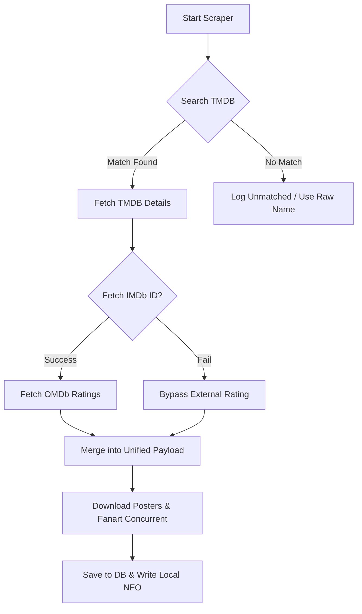

# Application Architecture & Technical Logic

This document provides a detailed breakdown of the internal technical logic and architecture of SelfHost Media Orchestrator's core services. 

## 1. The Two-Phase Scanner Logic

Traditional media scanners often lock the database or UI until thousands of files are fully parsed and scraped. To combat this, the Orchestrator uses a multi-threaded, two-phase delayed ingestion system.

### Phase 1: Fast Directory Sync
- **Operation**: A non-blocking `os.walk` file discovery.
- **Execution**: The system uses `ThreadPoolExecutor` to quickly parse filenames without requesting full file headers yet. 
- **Action**: Files are immediately batched and saved to the database with `status='unmatched'`. 
- **User Impact**: A 10,000+ file library will display in the user interface within seconds.

### Phase 2: Background Metadata Extraction
- **Operation**: The managed `_background_metadata_task` kicks off once files are discovered.
- **NFO Prioritization**:
  - The worker explicitly searches the directory for an `.nfo` file.
  - If a TMDB or IMDb ID is found in the NFO, it bypasses the internet scraper entirely, extracting local data immediately.
- **Parallel Header Analysis**: Heavy I/O blocking tools like `pymediainfo` are processed through an isolated ThreadPool queue, safely writing to the database using short-lived thread-safe `SessionLocal` contexts.

## 2. Scraper Chain & Fallback Mechanism

The `ScraperChain` acts as the metadata enrichment engine, transforming basic filenames into rich, cinematic media objects.

### Technical Highlights
- **Levenshtein Scoring**: Resolves name collisions by comparing the difference between the actual filename string and TMDB search results, weighted against the release year.
- **Asyncio Concurrency**: Scraper fetching tasks use `asyncio.gather()` to fetch TMDB details, OMDb metadata, Posters, and Fanart *in parallel*, rather than waiting for each to finish sequentially.
- **Semaphore Guards**: To prevent API bans, an `asyncio.Semaphore` throttles concurrent requests (40 requests / 10s for TMDB).

## 3. Real-Time State Management (SSE + Zustand)

Maintaining progress bars and UI state without forcing the frontend to spam API polling requests is handled via **Server-Sent Events (SSE)**.

### Backend Task Manager
- The backend features an in-memory dictionary tracking `active_tasks`.
- As multi-threaded functions scan or rename files, they update their percentage completion directly in this task manager.

### Frontend Synchronization
1. **The Stream**: The React app maintains an open connection to `GET /api/tasks/stream`.
2. **Event Push**: The TaskManager yields a JSON payload instantly whenever state changes.
3. **Zustand Receiver**: The Zustrand global store parses the event and patches the state tree, which causes progress bars to render instantly on the frontend without heavy CPU usage.

## 4. Path Parsing Pipeline (Regex Engine)

Robust filename parsing isolates media properties from Scene Release noise.

- **Movies**: 
  `r'^(.*?)[. (\[]*(?:((?:19|20)\d{2}))[. )\]]*(.*)$'`
  Distinguishes the Title, the 4-digit Release Year, and the remaining codec/resolution tags.
  
- **TV Shows**: 
  `r'^(.*?)[\. _-]S(\d{2})E(\d{2})[\. _-]?(.*)$'`
  Reliably matches strict Season/Episode configurations.

## 5. Automated Database Self-Healing

When hosting via Docker on Windows (using host volumes), SQLite occasionally faces "read-only" lock issues due to Windows filesystem protocols conflicting with Linux container boundaries.

**Migration Strategy:**
1. Upon boot, the application checks if the host-mounted legacy database flag is present.
2. If `data/orchestrator.db` isn't accessible, but a legacy file exists, `shutil.copy2` relocates the database entirely inside a native Docker Volume (`/data`).
3. Retry loops and `PRAGMA` variables ensure aggressive retries on subsequent database writes to mitigate any transient filesystem locks.
