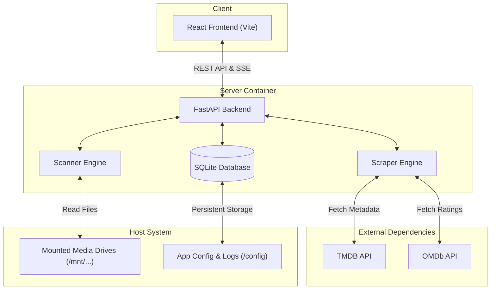

# SelfHost Media Orchestrator – System Design

This document details the macro-level system architecture of the SelfHost Media Orchestrator, highlighting how the core components communicate and are deployed.

## 1. High-Level Architecture

The system follows a standard modern three-tier architecture, neatly packaged into a unified Docker deployment for ease of self-hosting.

## 2. Component Layer Breakdown

### Frontend (User Interface)
- **Framework**: React 18 powered by Vite for lightning-fast HMR and building.
- **Styling**: TailwindCSS for precise, responsive, and cinematic UI design.
- **State Management**: Zustand simplifies global state management, particularly for storing active tasks and streaming updates from the backend without complex Redux boilerplates.
- **Communication**: Uses standard `fetch` API for REST calls, and `EventSource` for consuming Server-Sent Events (SSE) to display real-time progress bars natively.

### Backend (Core Server)
- **Framework**: FastAPI (Python 3.10+). Chosen for its asynchronous nature, automatic OpenAPI documentation, and very high performance.
- **Concurrency**: Mixes `asyncio` for non-blocking I/O network operations (like scraping) with `ThreadPoolExecutor` for heavy filesystem operations (like parsing metadata with `pymediainfo`).
- **Engines**: 
    - **Scanner**: Reads directories to identify media.
    - **Scraper**: Talks to public APIs.
    - **Manager**: Responsible for file renaming, folder cleanup, and hashing.

### Data Layer
- **Relational Database**: SQLite. Chosen because it requires zero configuration and perfectly aligns with the goal of an easily portable, self-hosted single-container app.
- **ORM**: SQLAlchemy. 

## 3. Docker Containerization & Volume Mapping

To ensure seamless installation, the entire stack (React build + Python API) runs within a **single Docker container**. The backend serves the compiled frontend static files.

### Volume Mappings Strategy
Because media files generally exist across multiple hard drives, the application uses generic volume mapping strategies:

- `/config`: Holds user settings, logs, and legacy database files.
- `/data`: The location of the actual SQLite database file, stored on a persistent volume to prevent 'ReadOnly Database' SQL locks on Windows hosts.
- `/mnt/X`: Standardized mount paths (e.g., `/mnt/d`, `/mnt/e`). This prevents path-breaking errors when migrating the container between Linux and Windows hosts.

## 4. Design Tenets

1. **Self-Contained Portability**: Your library stays yours. Metadata and artwork fallbacks are written locally next to the files whenever possible.
2. **Speed over Precision Initially**: Library ingestion focuses on instantly displaying files in the UI, then quietly enriching them with metadata in the background.
3. **Resiliency**: Built-in fallback mechanisms (e.g., if TMDB fails, try OMDb, try Cinemagoer, etc.) prevent ingestion bottlenecks.
