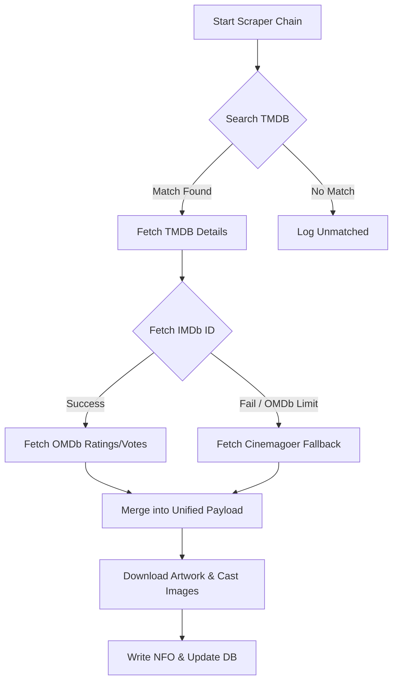

# SelfHost Media Orchestrator – Technical Logic Deep-Dive

This document provides a detailed technical breakdown of the "How and Why" behind SelfHost Media Orchestrator's core services. It is designed for developers who want to understand the underlying logic of the system.

---

## 1. Scanner Logic: Two-Phase Enrichment
The SelfHost Media Orchestrator scanner is designed to prioritize UI responsiveness while handling extremely large libraries.

### Phase 1: Fast Directory Sync
- **Operation**: A non-blocking `os.walk` or recursive glob.
- **Logic**: It identifies files with supported extensions (`.mkv`, `.mp4`, etc.) and immediately adds them to the database with a `status='unmatched'`.
- **Primary Goal**: To make the media visible in the UI within seconds, even for libraries with 10,000+ files.

### Phase 2: Background Metadata Extraction (Enrichment)
- **Operation**: A managed background thread (`_background_metadata_task`).
- **Logic**:
    1. **MediaInfo**: It calls `ffprobe` or `pymediainfo` *only* if the resolution/codec metrics are missing.
    2. **Local NFO Parsing**: It checks for any existing `.nfo` file. If found, it parses the XML and updates the database immediately, marking the record as `matched`.
- **Throttling**: To prevent overloading the SQLite database, progress updates to the UI are throttled to once per second using `time.time()`.

---

## 2. Scraper Chain & Fallback Mechanism
The `ScraperChain` orchestrates a series of API calls to build a complete metadata profile.



### Key Logic:
- **Search Scoring**: TMDB results are scored based on Title similarity (Levenshtein distance) and Year matching.
- **Rate Limiting**: Uses a **Token Bucket** algorithm (40 requests / 10s for TMDB) to prevent API bans.
- **Concurrent Processing**: `asyncio.gather` is used to fetch posters, fanart, and cast images in parallel for maximum speed.

---

## 3. Filename Parsing (Regex Engine)
The parsing logic in `parser.py` is the most critical part of the ingestion process.

### Movie Parsing Pattern:
```python
MOVIE_RE = r'^(.*?)[. (\[]*(?:((?:19|20)\d{2}))[. )\]]*(.*)$'
```
- **Goal**: Separate the Title from the Year and any trailing "tags" (Resolution, Codec).
- **Cleanup**: It automatically strips illegal OS characters and removes empty brackets (`[]`) that often appear in scene releases.

### TV Show & Episode Pattern:
```python
EPISODE_RE = r'^(.*?)[\. _-]S(\d{2})E(\d{2})[\. _-]?(.*)$'
```
- **Goal**: Identify the Season (S) and Episode (E) numbers reliably across various naming formats (`Show.Name.S01E01`, `Show.Name.1x01`, etc.).

---

## 4. Real-Time State Management (SSE + Zustand)
SelfHost Media Orchestrator uses **Server-Sent Events (SSE)** for non-blocking UI updates.

### Backend Task Manager:
- Maintains an in-memory dictionary of `active_tasks`.
- Each task (Scan, Scrape, Subtitle) updates its `progress_pct` and `status` in the dictionary.

### Frontend Synchronization:
- The React app establishes a `GET /api/tasks/stream` stream (SSE).
- The `TaskManager` sends a JSON payload whenever a task status changes.
- The **Zustand Store** accepts these events and updates the global `activeTasks` state instantly, triggering re-renders of progress bars and notification toasts without polling.

---

## 6. Configuration & Storage Mapping
SelfHost Media Orchestrator uses a decentralized configuration model designed for Docker environments.

### .env Configuration
- **Mechanism**: The system reads the `.env` file at startup to define drive mappings and API keys.
- **Drive Mapping**: Environment variables like `DRIVE_D_PATH=D:\` are used by Docker Compose to mount host drives into the container.

### Universal Drive Mapping
- **Strategy**: To ensure consistency across different host OS environments, all physical drives are mapped to a standard mount point inside the container: `/mnt/d`, `/mnt/e`, etc.
- **Benefit**: This allows the database to store portable, Linux-style paths that remain valid even if the container is moved or the host mapping changes slightly.

### Database
- **Path**: The primary database is stored at `data/orchestrator.db`.
- **Legacy Migration**: On startup, the system automatically checks for the legacy `mediavault.db` and migrates its content to the new structure if necessary.

### Self-Healing Database Migration (Docker/Windows Compatibility)
To resolve the "readonly database" error often encountered on Windows host-mounts, the system employs a migration strategy:
1. **Detection**: On initialization, the `Settings` class checks if `/config/mediavault.db` (legacy host-mount) exists but `/data/orchestrator.db` (internal writable volume) does not.
2. **Automated Move**: It uses `shutil.copy2` to move the existing database to the `/data` directory, which is backed by a Docker named volume (`db-data`).
3. **Lock Protection**: The database engine includes retry logic and `PRAGMA` guards to handle filesystem-level locking issues, ensuring the app stays running even on suboptimal storage configurations.

---

## 7. CI/CD & Automated Distribution

### GitHub Actions Workflow
- **Continuous Integration**: On every pull request to `main`, the build workflow is triggered to ensure the code builds successfully and passes linting.
- [x] Continuous Deployment: On every push to `main`, the workflow builds a production-ready image and pushes it to **Docker Hub** with the `latest` tag.
- [x] Optimization: The workflow uses `docker/setup-buildx-action` and GHA caching (`type=gha`) to speed up subsequent builds by up to 500%.

### Production vs. Development
- [x] Production Image: Optimized for size and security. The `--reload` flag is removed from the FastAPI server to prevent accidental code modifications in production.
- [x] User Distribution: Users are encouraged to pull from Docker Hub, which uses an immutable versioning scheme (e.g., `:latest`), ensuring they always run a verified, stable build.

---

## 8. High-Performance Download Mechanism
To facilitate fast media transfers within local networks, the system implements an optimized HTTP download engine.

### Zero-Copy Transfer
- **Backend Logic**: The `FileResponse` object in FastAPI is utilized for all media downloads. 
- **sendfile(2)**: On Linux systems (Docker/Production), this triggers the `sendfile` system call, which performs a **zero-copy transfer**. This means the data is copied directly from the disk cache to the network descriptor by the kernel, bypassing the application-level buffer entirely.
- **Speed**: This mechanism saturates local Gigabit or Multi-Gigabit network links, providing speeds equivalent to or better than traditional FTP, without the browser compatibility issues of the `ftp://` protocol.

### Frontend Integration
- **Context-Aware Links**: The UI dynamically generates download URLs based on the media type (Movie vs. Episode).
- **Native Browser Handling**: By using the `download` attribute on anchor tags, the system triggers the browser's native download manager, allowing for multi-threaded downloads, pausing/resuming, and integration with third-party download accelerators.

